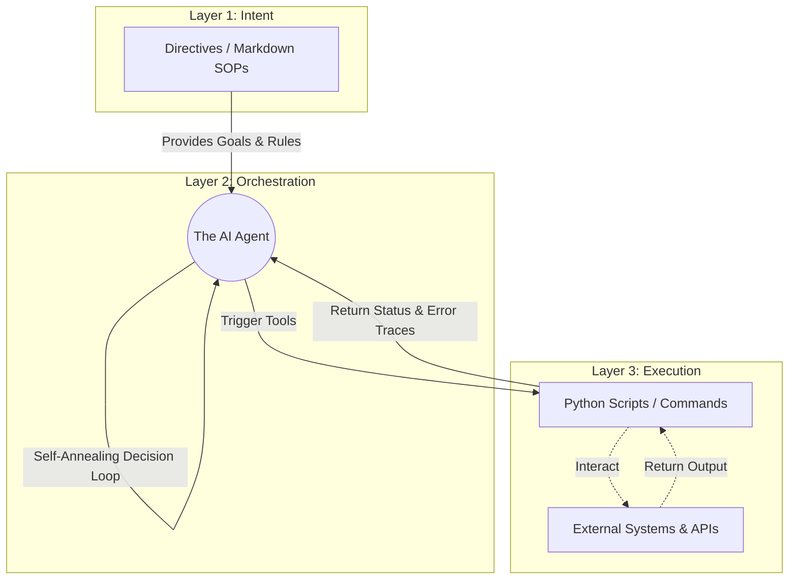

# Antigravity: Master Chaos File

Welcome to the **Master Chaos File**. This is the bleeding-edge testbed, experimental workspace, and primary template generation repository for the Antigravity agentic architecture. 

This repository serves two primary purposes:
1. **The Laboratory:** A safe, chaotic environment to run experiments, test new workflows, refine brand aesthetics, and build out automated pipelines.
2. **The Forge:** The secure origin point for the pristine `templates/` that get deployed into production environments and other codebases.

---

## 📂 Directory Structure & Architecture

From top to bottom, here is how the Master Chaos File is organized and what every single piece of the architecture does.

### The Agentic Core (`.agents/`)
The brain stem of the AI's behavior. This dictates *how* the agent operates, what rules it follows, and the standard operating procedures it executes.
*   **`.agents/rules/`**: The "Laws of Physics." These are global constraint files (e.g., `github_discipline.md`, `destructive_actions.md`) that prevent the AI from hallucinating dependencies, deleting critical files, or breaking Git history. They are always active.
*   **`.agents/workflows/`**: Step-by-step, codifed SOPs (e.g., `/rebranding`, `/github-flow`). When a user triggers a workflow, the agent executes these exact instructions chronologically without skipping.

### The 3-Layer Execution Engine
Antigravity operates on a 3-layer architecture to bridge probabilistic LLM thought with deterministic execution.

*   **`directives/`**: (Layer 1 - Intent) Markdown SOPs defining goals, inputs, and edge cases. These are natural language instructions for the agent.
*   *The Agent*: (Layer 2 - Orchestration) The LLM reading the directives and deciding what to execute.
*   **`execution/`**: (Layer 3 - Doing) Deterministic scripts that execute API calls, web scraping, and file operations. Highly reliable, testable, and self-annealing.

### Knowledge & Upgrades
*   **`skills/`**: Specialized utility folders (e.g., `brand-guidelines`). Skills give the agent specialized context (like applying the exact Hex codes and typography for the "Neon Grit Tech" aesthetic) without bloating the main instructions.

### Workspace Management
*   **`.tmp/`**: **The Scratchpad.** This is where scraped data, temporary dossiers, generated test files, and intermediate processing files live. 
    *   *When to clear it:* Because nothing in here is committed or permanent, you can clear this folder at any time. If an agent process breaks or states get weird, wipe the `.tmp/` folder and let the agent regenerate what it needs. Files like `brand-test.html` get overwritten here frequently during experiments.
*   **`.dev_notes/`**: **The Graveyard / Archive.** According to our Destructive Actions rule, the agent is not allowed to permanently `rm` (delete) substantial logic. Instead, deprecated code or old architectures are moved here for safe-keeping.

### The Golden Boilerplates
*   **`templates/`**: **DO NOT MESS WITH THESE UNLESS INTENTIONAL.** These are the pristine, stable exports. Once an experiment in the Chaos File is finalized, it is packaged into these templates.
    *   *New Projects Template:* For bootstrapping an empty repo from scratch.
    *   *Merge to Existing Projects:* For silently injecting Antigravity into an active codebase.

### Configuration & Base Instructions
*   **`AGENTS.md`, `CLAUDE.md`, `GEMINI.md`**: The base prompt layers. These are mirrored instruction sets ensuring that no matter what AI environment boots up this folder, it immediately understands the 3-Layer Architecture.
*   **`.env`**: Contains secure API keys and environment variables used by the `execution/` scripts. 
*   **`.gitignore`**: Ensures that `.env`, credentials, and the chaotic `.tmp/` folder are never committed to version control.
*   **`brand-test.html` (and other root testing files)**: Ephemeral test artifacts. When we run a `/rebranding` workflow, the agent will overwrite or generate HTML files like this to visually demonstrate the CSS. They are meant to be overwritten, broken, and tested.

---

## ⚡ The Golden Rule of the Chaos File
Everything in this repository outside of the `templates/` folder is fair game for chaotic experimentation, breaking, debugging, and rebuilding. **Protect the `templates/` folder**, and let the rest of the workspace serve as your testing ground for mastering the AI workflow.
